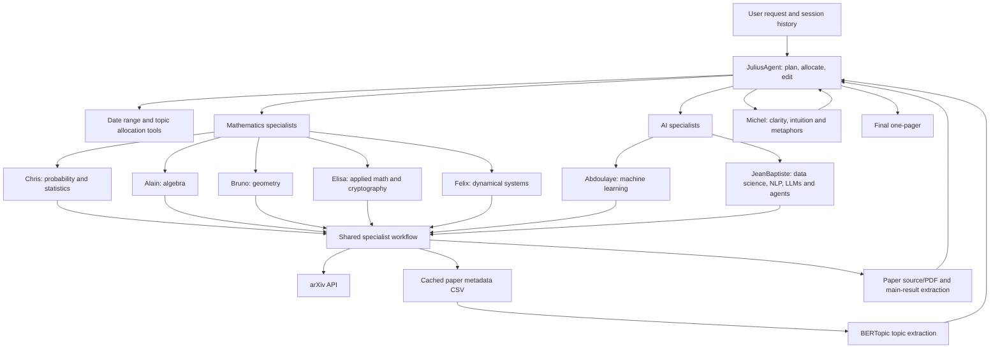

# Workflow guide

## Goal

The workflow produces an engaging, professional one-pager from recent arXiv
papers. A request can specify a date range, one to five topics, subject areas,
representative-paper count, whether main results are required, audience, and
tone. If a user does not set an audience or tone, Julius uses LinkedIn and a
professional tone.

## Agentic system



## Execution path

1. Julius receives the new request together with the current session history.
   It verifies that the request is in scope and extracts the date range.
2. Julius allocates at most five topics across the appropriate specialist
   agents. Each delegation includes the date range, topic count, audience,
   tone, and main-result requirement.
3. A specialist chooses only categories from its own configuration, checks the
   deterministic CSV cache, and fetches metadata from arXiv only when needed.
   It does not invent topics if the collection does not meet the configured
   paper threshold.
4. BERTopic groups titles and abstracts. The specialist returns representative
   arXiv IDs and titles for the selected clusters. When requested, it downloads
   LaTeX source (falling back to PDF extraction) and summarizes the paper's
   reported main result.
5. Julius creates the first editorial draft. For a general audience or a
   simplification request, it delegates the exact difficult material to Michel
   and incorporates that feedback before delivery.

## Specialist data contract

The shared specialist workflow returns a topic list equivalent to:

```json
{
  "ChrisAgent": [
    {
      "topic_title": "Short label",
      "topic_description": "What the cluster studies",
      "topic_count": 12,
      "representative_papers": [
        {
          "paper_title": "Paper title",
          "paper_arxiv_id": "2605.12345",
          "main_result": "Included only when requested"
        }
      ]
    }
  ]
}
```

Metadata persisted for topic extraction contains `arxiv_id`, `title`,
`authors`, `summary`, publication fields, category fields, and source links.
The cache file name includes the specialist, chosen categories, and requested
date range, so a repeated request safely reuses the same data.

## Reliability and limits

- arXiv requests are rate limited and retried. Source extraction falls back to
  PDF text extraction when an e-print source is unavailable.
- Tool responses preserve failures instead of fabricating papers or results.
- A one-pager is capped at five topics. Each specialist is constrained to its
  configured arXiv categories.
- `OPENAI_AGENTS_DISABLE_TRACING=1` disables trace export, which is useful for
  offline tests. Normal app runs use SDK tracing.
