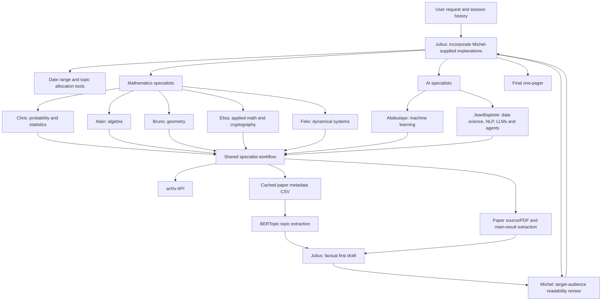

# Workflow guide

## Goal

The workflow produces an engaging, professional one-pager from recent arXiv
papers. A request can specify a date range, one to five topics, subject areas,
representative-paper count, whether main results are required, audience, and
tone. If a user does not set an audience or tone, Julius uses LinkedIn and a
professional tone.

## Agentic system



## Execution path

1. Julius receives the new request together with the current session history.
   It verifies that the request is in scope and extracts the date range.
2. Julius allocates at most five topics across the appropriate specialist
   agents. Each delegation includes the date range, topic count, audience,
   tone, and main-result requirement.
3. A specialist chooses only categories from its own configuration, checks the
   deterministic CSV cache, and fetches metadata from arXiv only when needed.
   It does not invent topics if the collection does not meet the configured
   paper threshold.
4. BERTopic groups titles and abstracts. The specialist returns representative
   arXiv IDs and titles for the selected clusters. When requested, it downloads
   LaTeX source (falling back to PDF extraction) and summarizes the paper's
   reported main result.
5. Julius creates a factual first editorial draft from the specialist outputs.
   This draft deliberately contains no pedagogical explanation, intuition,
   example, analogy, or metaphor; Julius does not generate that material.
   Instead, it marks every topic-description and main-result location with a
   `[[MICHEL_PEDAGOGY id="…" needed="yes|no"]]` placeholder. `yes` explicitly
   requests a Michel explanation, while `no` marks that no explanation is
   required for the target audience.
6. Every representative paper includes its factual main result. Julius sends the complete draft to Michel for a target-audience readability
   review. Michel returns exact ready-to-insert pedagogical text for every
   `needed="yes"` placeholder, using the matching identifier, while preserving
   paper titles, arXiv links, and technical claims. Each such explanation uses
   Michel's upbeat, curious, intuitive, and engaging style, with a relatable
   example or accurate metaphor whenever it improves understanding.
   Michel calls `get_pedagogical_explanation_tool` for each required marker;
   the tool uses a strict JSON-schema LLM response and returns the explanation
   that Michel places verbatim in the marker's `exact_text` field. Michel's
   complete review is also emitted as validated JSON for Julius.
7. Julius replaces every `needed="yes"` placeholder only with Michel's supplied
   `exact_text` verbatim, formatted immediately below the factual description or
   main result as `***Pedagogical explanation:** <Michel text>*`. It removes
   `needed="no"` placeholders and sends the revised
   complete one-pager back to Michel for another readability review.
   When invoking finalization, Julius passes Michel's entire JSON response—not
   only its feedback or explanation list—so the assessment, rationale, and
   pedagogical insertions remain available to the editorial step.
   The review/revision loop continues until Michel finds it readable for the
   target audience or three Michel reviews have been completed. Julius uses
   that final assessment to decide whether to deliver the one-pager.

## Specialist data contract

The shared specialist workflow returns a topic list equivalent to:

```json
{
  "ChrisAgent": [
    {
      "topic_title": "Short label",
      "topic_description": "What the cluster studies",
      "topic_count": 12,
      "representative_papers": [
        {
          "paper_title": "Paper title",
          "paper_arxiv_id": "2605.12345",
          "main_result": "Included only when requested"
        }
      ]
    }
  ]
}
```

Metadata persisted for topic extraction contains `arxiv_id`, `title`,
`authors`, `summary`, publication fields, category fields, and source links.
The cache file name includes the specialist, chosen categories, and requested
date range, so a repeated request safely reuses the same data.

## Reliability and limits

- arXiv requests are rate limited and retried. Source extraction falls back to
  PDF text extraction when an e-print source is unavailable.
- Tool responses preserve failures instead of fabricating papers or results.
- A one-pager is capped at five topics. Each specialist is constrained to its
  configured arXiv categories.
- `OPENAI_AGENTS_DISABLE_TRACING=1` disables trace export, which is useful for
  offline tests. Normal app runs use SDK tracing.
